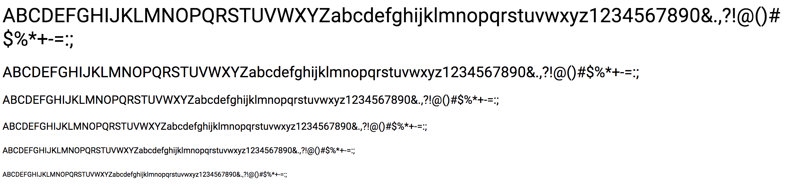
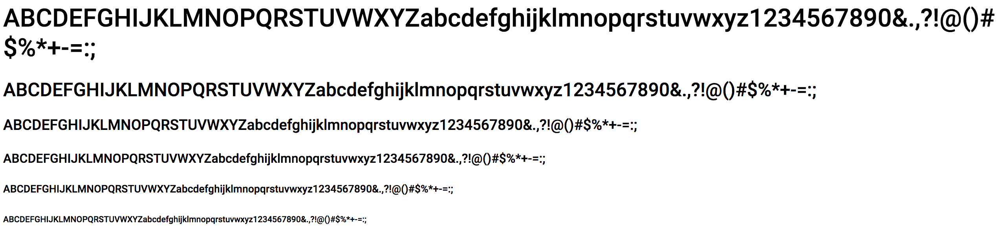
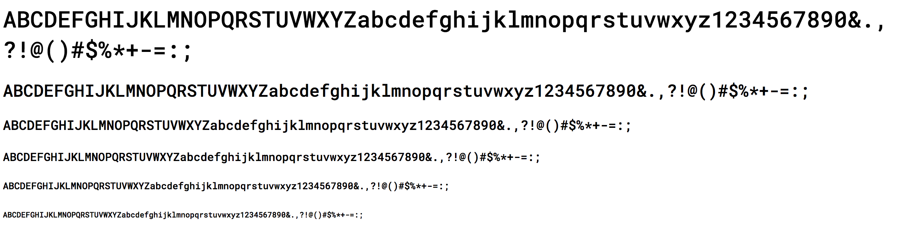
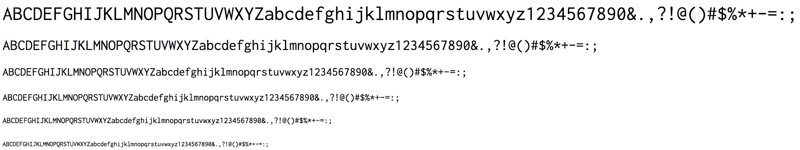
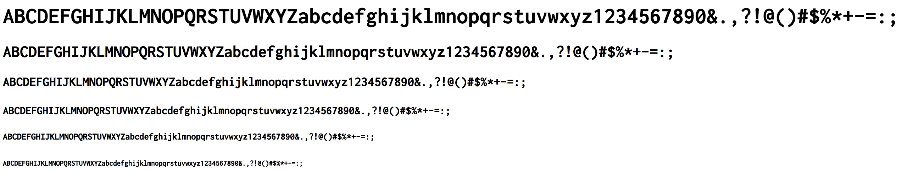

# Google fonts

## Roboto 400 and 500

`Roboto 500` works well for titles, especially when in uppercase. `Roboto 400` can be used for regular text like paragraphs etc.

- 400

  

- 500

  

```scss
@import url('https://fonts.googleapis.com/css?family=Roboto:400,500');

h1 {
  font-family: 'Roboto', sans-serif;
  font-weight: 400; // or...
  font-weight: 500;
}
```

## Roboto Mono 500

Can be used for titles like `Roboto 500`, but it's also more versatile and can be used for things like navigation links and code blocks, since it's monospaced.



```scss
@import url('https://fonts.googleapis.com/css?family=Roboto+Mono:500');

h1 {
  font-family: 'Roboto Mono', monospace;
  font-weight: 500;
}
```

## Inconsolata 400 and 700

Similar to `Roboto Mono 500`, great for code blocks and navigation links.

- 400

  

- 700

  

```scss
@import url('https://fonts.googleapis.com/css?family=Inconsolata:400,700');

h1 {
  font-family: 'Inconsolata', monospace;
  font-weight: 400; // or...
  font-weight: 700;
}
```

---

To import all of the Google fonts together:

```scss
@import url('https://fonts.googleapis.com/css?family=Inconsolata:400,700|Roboto+Mono:500|Roboto:400,500');
```

---

## Other Google fonts

- [Athiti](https://fonts.google.com/specimen/Athiti)
- [Alegreya](https://fonts.google.com/specimen/Alegreya)
